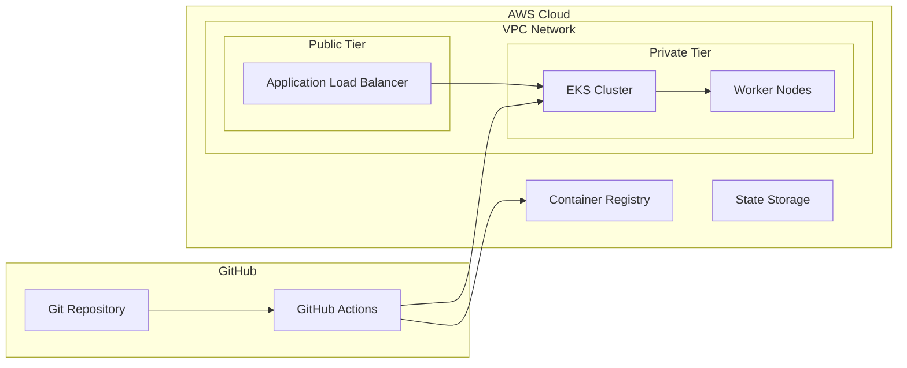

# DevOps Automation Suite

A production-grade infrastructure automation project demonstrating modern DevOps practices, including Infrastructure as Code, Kubernetes orchestration, and GitOps deployment patterns.

## Project Overview

This project implements a complete cloud-native infrastructure stack with:

- **Infrastructure as Code (IaC)**: Terraform modules for AWS resource provisioning
- **Container Orchestration**: EKS cluster with automated scaling and deployment
- **GitOps Workflow**: ArgoCD for declarative Kubernetes management
- **CI/CD Pipeline**: Automated testing, building, and deployment
- **Monitoring Stack**: Prometheus and Grafana for observability

### Architecture Overview



## Infrastructure Design

### Key Design Decisions

1. **Network Architecture**
   - VPC with public/private subnets for security isolation
   - NAT Gateways for outbound private subnet connectivity
   - Security groups following principle of least privilege

2. **Kubernetes Architecture**
   - EKS for managed control plane
   - Auto-scaling node groups for cost optimization
   - Private endpoint access for enhanced security

3. **Deployment Strategy**
   - GitOps workflow with ArgoCD
   - Blue/green deployments for zero-downtime updates
   - Automated rollbacks on failure detection

### Security Considerations

- **Network Security**
  - Private subnets for workload isolation
  - Security group rules limited to required ports
  - VPC endpoints for AWS service access

- **Access Control**
  - IAM roles following least privilege
  - RBAC for Kubernetes resource access
  - Service account token authentication

- **Data Protection**
  - Encryption at rest for all storage
  - TLS termination at load balancer
  - Secrets management through K8s secrets

## Component Details

### Terraform Infrastructure

The infrastructure is modularized for reusability and maintainability:

```hcl
module "networking" {
  source = "./modules/networking"
  # VPC, subnets, and security configuration
}

module "eks" {
  source = "./modules/eks"
  # Kubernetes cluster and node configuration
}
```

Key features:
- Modular design for component reuse
- State management with S3 backend
- Automated drift detection

### Kubernetes Deployment

Application deployments use industry best practices:

```yaml
apiVersion: apps/v1
kind: Deployment
metadata:
  name: app-deployment
spec:
  replicas: 2
  strategy:
    type: RollingUpdate
  template:
    spec:
      containers:
      - name: app
        resources:
          requests:
            cpu: 100m
            memory: 128Mi
          limits:
            cpu: 500m
            memory: 512Mi
```

Features:
- Resource quotas for predictable scaling
- Health checks for reliability
- Auto-scaling based on metrics
- Zero-downtime deployments

### CI/CD Pipeline

The automated pipeline ensures reliable deployments:

1. **Build Stage**
   - Code validation
   - Security scanning
   - Container image building

2. **Test Stage**
   - Infrastructure validation
   - Unit/Integration testing
   - Compliance checking

3. **Deploy Stage**
   - Infrastructure updates
   - Application deployment
   - Health verification

## Performance Considerations

### Scaling Strategy

The infrastructure automatically scales based on:
- CPU utilization (target: 70%)
- Memory usage (target: 80%)
- Request latency (target: <500ms)

### Cost Optimization

Cost management features:
- Spot instances for non-critical workloads
- Auto-scaling for efficient resource use
- Multi-AZ deployment for reliability

### Monitoring and Alerting

Observability stack provides:
- Real-time metrics collection
- Custom dashboards for visualization
- Automated alerting for incidents

## Getting Started

### Prerequisites

- AWS Account with administrator access
- GitHub account with repository access
- Terraform >= 1.5.7
- kubectl >= 1.27
- AWS CLI v2

### Quick Start

1. **Clone and Configure**
   ```bash
   # Clone repository
   git clone https://github.com/yourusername/devops-automation-suite.git
   cd devops-automation-suite

   # Configure AWS credentials
   aws configure
   ```

2. **Deploy Infrastructure**
   ```bash
   # Initialize Terraform
   cd terraform/environments/dev
   terraform init

   # Review and apply changes
   terraform plan
   terraform apply
   ```

3. **Access Cluster**
   ```bash
   # Update kubeconfig
   aws eks update-kubeconfig --name devops-portfolio-dev-cluster

   # Verify access
   kubectl get nodes
   ```

### Common Operations

#### Deploying Updates
```bash
# Update application version
git commit -am "Update application to v1.2.3"
git push origin main

# ArgoCD will automatically sync changes
```

#### Scaling Resources
```bash
# Scale worker nodes
terraform apply -var 'node_desired_capacity=4'

# Scale application replicas
kubectl scale deployment/app-deployment --replicas=4
```

## Troubleshooting

### Common Issues

1. **EKS Connection Issues**
   ```bash
   # Verify AWS credentials
   aws sts get-caller-identity

   # Check VPC endpoints
   aws ec2 describe-vpc-endpoints
   ```

2. **Deployment Failures**
   ```bash
   # Check pod status
   kubectl get pods -n app-namespace

   # View pod logs
   kubectl logs deployment/app-deployment
   ```

## Contributing

Contributions welcome! Please follow our workflow:

1. Fork the repository
2. Create a feature branch
3. Commit your changes
4. Create a pull request

## License

This project is licensed under the MIT License - see the LICENSE file for details.
