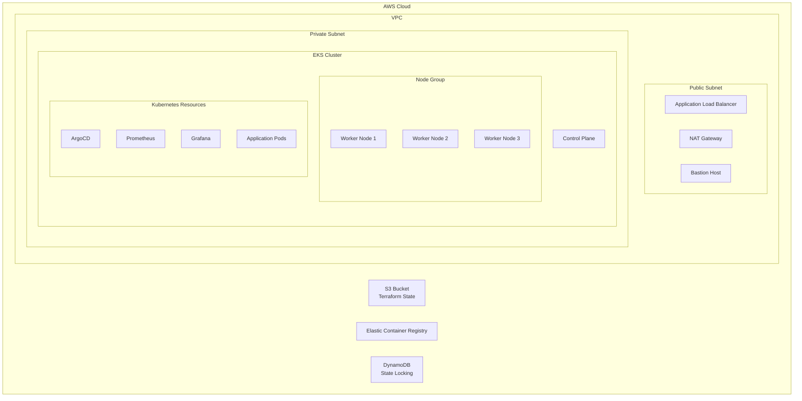

# Architecture Guide

This document details the architectural decisions, patterns, and infrastructure design implemented in this project.

## System Architecture

### Infrastructure Overview


## Design Decisions

### Network Architecture

#### VPC Design
```hcl
# Location: terraform/modules/networking/main.tf
resource "aws_vpc" "main" {
  cidr_block           = var.vpc_cidr
  enable_dns_support   = true
  enable_dns_hostnames = true
}
```

Design Considerations:
1. **Subnet Tiers**
   - Public subnets for load balancers
   - Private subnets for workloads
   - Multiple AZs for redundancy

2. **Network Security**
   - Security group segmentation
   - Network ACL rules
   - VPC endpoints for AWS services

### Container Orchestration

#### EKS Configuration
Location: `terraform/modules/eks/main.tf`

1. **Control Plane**
   - Managed by AWS
   - Private API endpoint
   - OIDC integration

2. **Node Groups**
   - Auto-scaling configuration
   - Instance diversity
   - Resource optimization

### Storage Architecture

1. **State Management**
   ```hcl
   # Location: terraform/environments/dev/backend.tf
   terraform {
     backend "s3" {
       bucket         = "devops-portfolio-terraform-state"
       dynamodb_table = "devops-portfolio-terraform-locks"
       encrypt        = true
     }
   }
   ```

2. **Application Storage**
   - EBS volumes for persistent storage
   - S3 for object storage
   - EFS for shared filesystem (when needed)

## Security Architecture

### Authentication & Authorization

1. **IAM Integration**
   ```hcl
   # Location: terraform/modules/eks/iam.tf
   resource "aws_iam_role" "eks_cluster" {
     name = "${var.cluster_name}-cluster-role"
     # ... role configuration
   }
   ```

2. **RBAC Configuration**
   ```yaml
   # Location: kubernetes/manifests/rbac.yaml
   apiVersion: rbac.authorization.k8s.io/v1
   kind: Role
   metadata:
     name: app-role
   rules:
     - apiGroups: [""]
       resources: ["pods"]
       verbs: ["get", "list"]
   ```

### Network Security

1. **Security Groups**
   ```hcl
   # Location: terraform/modules/networking/security.tf
   resource "aws_security_group" "eks_cluster" {
     name_prefix = "eks-cluster-"
     vpc_id      = aws_vpc.main.id
     
     ingress {
       from_port = 443
       to_port   = 443
       protocol  = "tcp"
     }
   }
   ```

2. **Network Policies**
   ```yaml
   # Location: kubernetes/manifests/network-policies.yaml
   apiVersion: networking.k8s.io/v1
   kind: NetworkPolicy
   metadata:
     name: default-deny
   spec:
     podSelector: {}
     policyTypes:
     - Ingress
   ```

## Scalability Architecture

### Horizontal Scaling

1. **Node Auto-scaling**
   ```hcl
   # Location: terraform/modules/eks/node_groups.tf
   resource "aws_eks_node_group" "main" {
     scaling_config {
       desired_size = var.node_desired_capacity
       max_size     = var.node_max_capacity
       min_size     = var.node_min_capacity
     }
   }
   ```

2. **Pod Auto-scaling**
   ```yaml
   # Location: kubernetes/manifests/app/hpa.yaml
   apiVersion: autoscaling/v2
   kind: HorizontalPodAutoscaler
   metadata:
     name: app-hpa
   spec:
     maxReplicas: 10
     metrics:
     - type: Resource
       resource:
         name: cpu
         target:
           type: Utilization
           averageUtilization: 70
   ```

## Monitoring Architecture

### Metrics Collection

1. **Prometheus Configuration**
   ```yaml
   # Location: kubernetes/manifests/monitoring/prometheus.yaml
   apiVersion: monitoring.coreos.com/v1
   kind: Prometheus
   metadata:
     name: prometheus
   spec:
     serviceMonitorSelector:
       matchLabels:
         team: frontend
   ```

2. **Grafana Dashboards**
   ```yaml
   # Location: kubernetes/manifests/monitoring/grafana.yaml
   apiVersion: integreatly.org/v1alpha1
   kind: Grafana
   metadata:
     name: grafana
   spec:
     dashboardProviders:
       dashboardproviders.yaml:
         apiVersion: 1
   ```

## Disaster Recovery

### Backup Strategy

1. **State Backup**
   - S3 versioning
   - DynamoDB point-in-time recovery
   - Regular snapshot schedule

2. **Application Backup**
   - Volume snapshots
   - Configuration backups
   - Data export procedures

### Recovery Procedures

1. **Infrastructure Recovery**
   ```bash
   # Location: scripts/disaster-recovery.sh
   # Restore from backup
   aws s3 cp s3://backup-bucket/terraform.tfstate terraform/
   terraform init
   terraform apply
   ```

2. **Application Recovery**
   ```bash
   # Restore application state
   kubectl apply -f kubernetes/manifests/backup/
   ```

## Performance Optimization

### Resource Management

1. **Container Resources**
   ```yaml
   # Location: kubernetes/manifests/app/deployment.yaml
   resources:
     requests:
       cpu: 100m
       memory: 128Mi
     limits:
       cpu: 200m
       memory: 256Mi
   ```

2. **Node Optimization**
   - Instance type selection
   - Kernel parameters
   - Container runtime settings

## Future Considerations

### Planned Improvements

1. **Service Mesh Integration**
   - Traffic management
   - Security policies
   - Observability

2. **Multi-Region Support**
   - Global load balancing
   - Data replication
   - Disaster recovery

### Scalability Roadmap

1. **Infrastructure Scaling**
   - Multi-cluster support
   - Cross-region deployment
   - Edge computing integration

2. **Application Scaling**
   - Microservices decomposition
   - Cache integration
   - Database sharding
