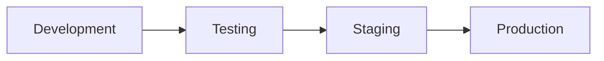

# Deployment Guide

This document outlines the deployment patterns, procedures, and best practices implemented in this project.

## Table of Contents
- [Deployment Patterns](#deployment-patterns)
- [CI/CD Pipeline](#cicd-pipeline)
- [GitOps Workflow](#gitops-workflow)
- [Rollback Procedures](#rollback-procedures)
- [Production Checklist](#production-checklist)

## Deployment Patterns

### Blue-Green Deployments
Our EKS cluster is configured for blue-green deployments using the following pattern:

```yaml
# Location: kubernetes/manifests/app/deployment.yaml
apiVersion: apps/v1
kind: Deployment
metadata:
  name: app-deployment
spec:
  strategy:
    type: RollingUpdate
    rollingUpdate:
      maxSurge: 1
      maxUnavailable: 0
```

Benefits:
- Zero-downtime deployments
- Instant rollback capability
- Production-like testing environment

### Canary Releases
For gradual rollouts, we use Kubernetes service weights:

```yaml
# Location: kubernetes/manifests/app/service.yaml
apiVersion: v1
kind: Service
metadata:
  name: app-service
  annotations:
    service.beta.kubernetes.io/aws-load-balancer-type: nlb
spec:
  selector:
    app: sample-app
    version: v1  # Version label for traffic splitting
```

## CI/CD Pipeline

### GitHub Actions Workflow
Location: `.github/workflows/ci-cd.yml`

Pipeline Stages:
1. **Validation**
   ```yaml
   terraform-validate:
     steps:
       - name: Terraform Format Check
         run: terraform fmt -check -recursive
   ```

2. **Build & Test**
   ```yaml
   build-and-push:
     steps:
       - name: Build and push Docker image
         uses: docker/build-push-action@v4
   ```

3. **Deployment**
   ```yaml
   deploy:
     steps:
       - name: Apply Kubernetes manifests
         run: kubectl apply -f kubernetes/manifests/app
   ```

### Environment Promotion


## GitOps Workflow

### ArgoCD Configuration
Location: `argocd/applications/app.yaml`

```yaml
apiVersion: argoproj.io/v1alpha1
kind: Application
metadata:
  name: sample-app
spec:
  syncPolicy:
    automated:
      prune: true
      selfHeal: true
```

### Sync Strategies
1. **Automated Sync**
   - Automatic drift detection
   - Self-healing capabilities
   - Prune orphaned resources

2. **Manual Sync**
   - Required for sensitive changes
   - Used in production environment
   - Manual verification steps

## Rollback Procedures

### Immediate Rollback
```bash
# Revert to previous version
kubectl rollout undo deployment/app-deployment

# Verify rollback
kubectl rollout status deployment/app-deployment
```

### Infrastructure Rollback
```hcl
# Location: terraform/environments/dev/main.tf
terraform {
  # State versioning enabled
  backend "s3" {
    bucket = "devops-portfolio-terraform-state"
    key    = "dev/terraform.tfstate"
  }
}
```

## Production Checklist

### Pre-Deployment
- [ ] All tests passing
- [ ] Security scan completed
- [ ] Resource limits configured
- [ ] Monitoring setup verified
- [ ] Backup procedure tested

### Post-Deployment
- [ ] Health checks passing
- [ ] Metrics collection verified
- [ ] Alerts configured
- [ ] Documentation updated
- [ ] Rollback plan verified

## Deployment Commands

### Initial Deployment
```bash
# Deploy infrastructure
cd terraform/environments/dev
terraform init
terraform apply

# Deploy application
kubectl apply -f kubernetes/manifests/app/

# Verify deployment
kubectl get deployments,services,pods
```

### Update Deployment
```bash
# Update application version
git tag v1.2.3
git push origin v1.2.3

# ArgoCD will automatically sync
argocd app sync sample-app
```

### Monitoring Deployment
```bash
# Check deployment status
kubectl rollout status deployment/app-deployment

# View pod status
kubectl get pods -w

# Check logs
kubectl logs -l app=sample-app --tail=100
```

## Common Issues and Solutions

### Deployment Failures
Problem: Pods failing to start
```bash
# Check pod status
kubectl describe pod <pod-name>

# Check pod logs
kubectl logs <pod-name>
```

### Resource Constraints
Problem: Insufficient resources
```bash
# Check resource usage
kubectl top pods
kubectl top nodes

# Scale resources
kubectl scale deployment/app-deployment --replicas=3
```

## Best Practices

1. **Version Control**
   - Tag all releases
   - Use semantic versioning
   - Keep change history

2. **Configuration Management**
   - Use ConfigMaps for configuration
   - Manage secrets securely
   - Environment-specific values

3. **Monitoring**
   - Track deployment metrics
   - Set up alerts
   - Monitor resource usage

4. **Documentation**
   - Update deployment docs
   - Record configuration changes
   - Document troubleshooting steps

