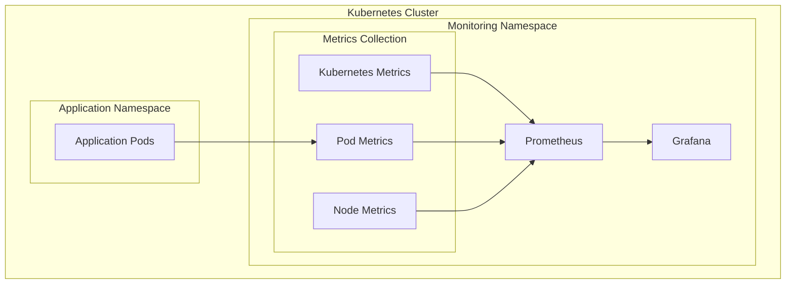

# Monitoring Stack Documentation

## Overview

This document details the monitoring implementation in our infrastructure. The monitoring stack consists of:
- Prometheus for metrics collection
- Grafana for visualization
- Custom dashboards for cluster insights

### Stack Components



## Prometheus Configuration

### Deployment Details
Location: `kubernetes/manifests/monitoring/prometheus-deployment.yaml`

```yaml
# Key configurations
resources:
  requests:
    cpu: 500m
    memory: 512Mi
  limits:
    cpu: 1
    memory: 1Gi
```

### Metrics Collection
Prometheus is configured to collect:
- Kubernetes API server metrics
- Node metrics
- Pod metrics
- Service metrics

### Access Controls
- ServiceAccount: `prometheus`
- ClusterRole: Permissions for metrics collection
- Namespaced access to monitoring resources

## Grafana Setup

### Deployment Configuration
Location: `kubernetes/manifests/monitoring/grafana-deployment.yaml`

Key features:
- Resource limits and requests defined
- Health checks implemented
- Persistent storage for dashboards
- Auto-provisioning of data sources

### Dashboard Provisioning
Location: `kubernetes/manifests/monitoring/grafana-dashboard-provisioning.yaml`

```yaml
providers:
- name: 'default'
  orgId: 1
  folder: ''
  type: file
  disableDeletion: false
  editable: true
```

## Implemented Dashboards

### Kubernetes Cluster Monitoring
Location: `kubernetes/manifests/monitoring/grafana-dashboards-config.yaml`

1. **Resource Usage Panels**
   - CPU usage by pod
   - Memory usage by pod
   - Number of pods
   - Number of nodes

2. **Network Metrics**
   - Network traffic by pod (receive/transmit)
   - Bandwidth usage
   - Network error rates

3. **Storage Metrics**
   - Disk usage by pod
   - I/O operations (reads/writes)
   - Storage latency

### Dashboard Screenshots

For visualization reference, our dashboard includes:

```
+-------------------------+-------------------------+
|                         |                         |
|      CPU Usage         |     Memory Usage       |
|                         |                         |
+-------------------------+-------------------------+
|                         |                         |
|    Number of Pods      |    Number of Nodes     |
|                         |                         |
+-------------------------+-------------------------+
|                         |                         |
|   Network Traffic      |     Disk Usage         |
|                         |                         |
+-------------------------+-------------------------+
|                         |                         |
|     Disk I/O           |                         |
|                         |                         |
+-------------------------+-------------------------+
```

## Metrics Details

### System Metrics
- `container_cpu_usage_seconds_total`
- `container_memory_usage_bytes`
- `kube_pod_info`
- `kube_node_info`

### Network Metrics
- `container_network_receive_bytes_total`
- `container_network_transmit_bytes_total`

### Storage Metrics
- `container_fs_usage_bytes`
- `container_fs_reads_total`
- `container_fs_writes_total`

## Access and Security

### Authentication
- Admin access via password authentication
- Anonymous access enabled (viewer role)
- Basic auth enabled

### Network Access
- Internal cluster access via Service
- External access via Ingress (ALB)
- TLS termination at load balancer

## Maintenance Procedures

### Updating Dashboards
1. Edit dashboard JSON in ConfigMap
2. Apply changes:
   ```bash
   kubectl apply -f kubernetes/manifests/monitoring/grafana-dashboards-config.yaml
   ```

### Scaling Prometheus
Current resource allocation:
```yaml
resources:
  requests:
    cpu: 500m
    memory: 512Mi
  limits:
    cpu: 1
    memory: 1Gi
```

Adjust based on metrics volume and retention period.

### Data Retention
- Prometheus retention: Default 15 days
- Configurable via deployment parameters

## Troubleshooting Guide

### Common Issues

1. **Prometheus Not Collecting Metrics**
   ```bash
   # Check Prometheus pods
   kubectl get pods -n monitoring
   
   # View Prometheus logs
   kubectl logs -l app=prometheus -n monitoring
   ```

2. **Grafana Dashboard Not Loading**
   ```bash
   # Verify ConfigMaps
   kubectl get configmap -n monitoring
   
   # Check Grafana logs
   kubectl logs -l app=grafana -n monitoring
   ```

3. **Missing Metrics**
   ```bash
   # Check Prometheus targets
   kubectl port-forward svc/prometheus -n monitoring 9090:9090
   # Access localhost:9090/targets
   ```

## Adding New Metrics

### Process
1. Update Prometheus configuration
2. Add recording rules if needed
3. Create new dashboard panels
4. Update documentation

### Example Configuration
```yaml
scrape_configs:
  - job_name: 'custom-metrics'
    kubernetes_sd_configs:
      - role: pod
    relabel_configs:
      - source_labels: [__meta_kubernetes_pod_annotation_prometheus_io_scrape]
        action: keep
        regex: true
```

## Future Enhancements

Potential improvements to consider:
1. Add alerting rules for critical metrics
2. Implement distributed tracing
3. Add custom metrics for application monitoring
4. Enhance dashboard with application-specific metrics

## References

- [Prometheus Documentation](https://prometheus.io/docs/)
- [Grafana Documentation](https://grafana.com/docs/)
- [Kubernetes Monitoring Guide](https://kubernetes.io/docs/tasks/debug-application-cluster/resource-usage-monitoring/)

