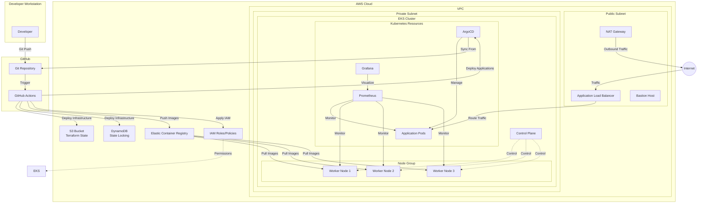

```mermaid
flowchart TB
    subgraph "AWS Cloud"
        subgraph "VPC"
            subgraph "Public Subnet"
                ALB["Application Load Balancer"]
                NAT["NAT Gateway"]
                BASTION["Bastion Host"]
            end
            
            subgraph "Private Subnet"
                subgraph "EKS Cluster"
                    CP["Control Plane"]
                    
                    subgraph "Node Group"
                        N1["Worker Node 1"]
                        N2["Worker Node 2"]
                        N3["Worker Node 3"]
                    end
                    
                    subgraph "Kubernetes Resources"
                        ARGOCD["ArgoCD"]
                        PROM["Prometheus"]
                        GRAFANA["Grafana"]
                        APP["Application Pods"]
                    end
                end
            end
        end
        
        S3["S3 Bucket\nTerraform State"]
        ECR["Elastic Container Registry"]
        DYNAMODB["DynamoDB\nState Locking"]
        IAM["IAM Roles/Policies"]
    end
    
    subgraph "GitHub"
        GH_REPO["Git Repository"]
        GH_ACTIONS["GitHub Actions"]
    end
    
    subgraph "Developer Workstation"
        DEV["Developer"]
    end
    
    %% Connections
    DEV -->|Git Push| GH_REPO
    GH_REPO -->|Trigger| GH_ACTIONS
    GH_ACTIONS -->|Deploy Infrastructure| S3
    GH_ACTIONS -->|Deploy Infrastructure| DYNAMODB
    GH_ACTIONS -->|Push Images| ECR
    GH_ACTIONS -->|Apply IAM| IAM
    GH_ACTIONS -->|Deploy Applications| ARGOCD
    
    ECR -->|Pull Images| N1
    ECR -->|Pull Images| N2
    ECR -->|Pull Images| N3
    
    IAM -.->|Permissions| EKS
    
    ALB -->|Route Traffic| APP
    
    ARGOCD -->|Manage| APP
    ARGOCD -->|Sync From| GH_REPO
    
    PROM -->|Monitor| APP
    PROM -->|Monitor| N1
    PROM -->|Monitor| N2
    PROM -->|Monitor| N3
    
    GRAFANA -->|Visualize| PROM
    
    CP -.->|Control| N1
    CP -.->|Control| N2
    CP -.->|Control| N3
    
    %% Internet Gateway is implied
    Internet((Internet)) -->|Traffic| ALB
    NAT -->|Outbound Traffic| Internet
```