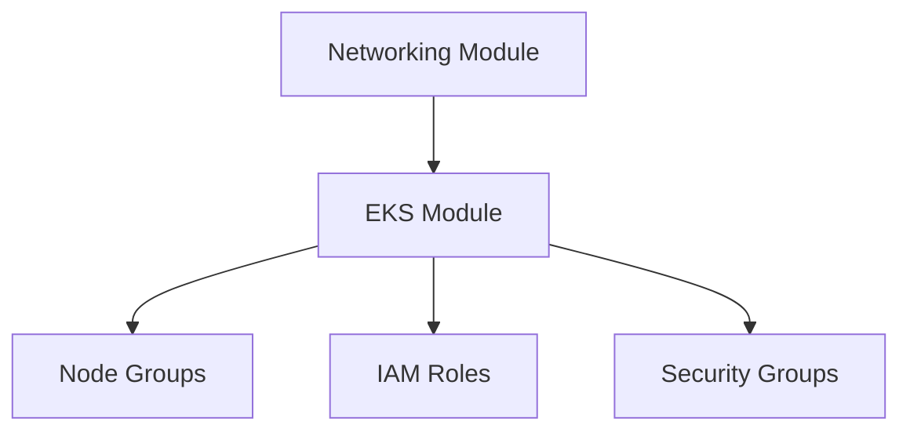

# Terraform Module Documentation

## EKS Module

### Design Decisions

#### Node Group Configuration
```hcl
resource "aws_eks_node_group" "main" {
  # ... other configuration ...
  
  scaling_config {
    desired_size = var.node_desired_capacity
    max_size     = var.node_max_capacity
    min_size     = var.node_min_capacity
  }
}
```

- Configurable scaling limits
- Instance type selection for workload optimization
- Supports mixed instance types

#### IAM Security
- Least privilege access
- Service account roles
- Clear separation of duties

#### Networking Integration
- Private endpoint configuration
- Security group management
- Load balancer integration

### Best Practices Implemented

1. **High Availability**
   - Multi-AZ deployment
   - Control plane redundancy
   - Worker node distribution

2. **Security**
   - Private API endpoint
   - Node-to-node encryption
   - RBAC configuration

3. **Scalability**
   - Auto-scaling configuration
   - Resource quotas
   - Performance optimization

### Cost Optimization

1. **Instance Selection**
   ```hcl
   variable "node_instance_types" {
     description = "EC2 instance types to use for EKS node groups"
     type        = list(string)
     default     = ["t3.medium"]  # Cost-effective for dev
   }
   ```

2. **Auto-scaling Configuration**
   - Minimum nodes for availability
   - Maximum nodes for cost control
   - Spot instances where appropriate

### Monitoring and Logging

1. **CloudWatch Integration**
   - Control plane logging
   - Worker node metrics
   - Container insights

2. **Metrics Collection**
   - Resource utilization
   - Performance metrics
   - Cost allocation

## Usage Guidelines

### Prerequisites
- AWS credentials configured
- Terraform >= 1.5.7
- Required AWS permissions

### Module Dependencies


### Common Operations

1. **Scaling Cluster**
   ```hcl
   # Increase worker nodes
   module "eks" {
     source = "./modules/eks"
     node_desired_capacity = 4  # Adjust as needed
   }
   ```

2. **Updating Kubernetes Version**
   ```hcl
   module "eks" {
     source = "./modules/eks"
     cluster_version = "1.27"  # Specify version
   }
   ```

3. **Adding Node Groups**
   ```hcl
   # Add specialized node group
   resource "aws_eks_node_group" "specialized" {
     # Configuration for specific workloads
   }
   ```

### Troubleshooting

1. **Common Issues**
   - IAM role permissions
   - Security group configurations
   - VPC endpoint connectivity

2. **Debugging Steps**
   ```bash
   # Verify AWS credentials
   aws sts get-caller-identity

   # Check EKS status
   aws eks describe-cluster --name cluster-name

   # Validate node group status
   aws eks describe-nodegroup --cluster-name cluster-name --nodegroup-name nodegroup-name
   ```

### Security Best Practices

1. **Network Security**
   - Use private endpoints
   - Implement network policies
   - Configure security groups

2. **Access Control**
   - Implement RBAC
   - Use IAM roles
   - Enable audit logging

3. **Data Protection**
   - Enable encryption
   - Implement backup policies
   - Configure secret management

